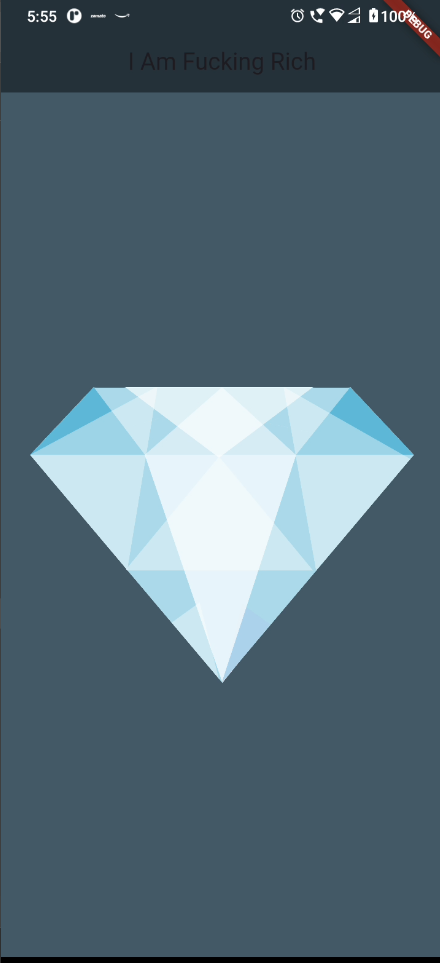

```
# I Am Rich Flutter App

Welcome to my take on the classic "I Am Rich" app! This Flutter project is a simple, clean showcase of Flutter UI, theming, and asset management. The app displays a diamond image with a bold message, all wrapped in a modern Material Design look.

## Preview

Check out how the app looks:



## Features

- Sleek Material Design interface
- Custom color palette for a premium feel
- Asset image display (diamond)
- Minimal, focused codebase

## Getting Started

1. Clone this repo.
2. Run `flutter pub get` to fetch dependencies.
3. Make sure the asset at `Images/diamond.png` is present.
4. Launch the app on your device or emulator.

## Assets

- `Images/diamond.png` — The diamond image used in the app

## About

This project is a fun experiment with Flutter, inspired by the original "I Am Rich" app. It's all about simplicity and style.

---

Built with ❤️ using Flutter & Dart.

```